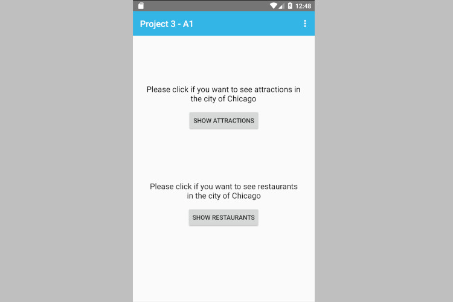
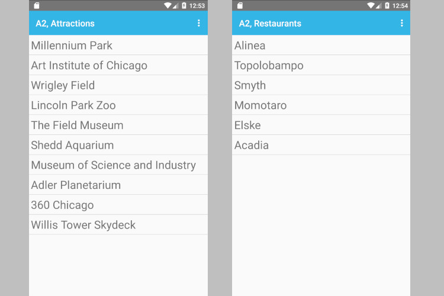
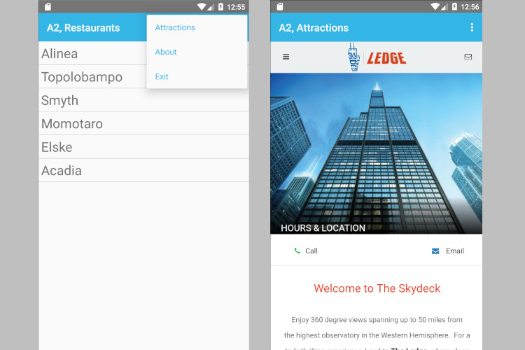
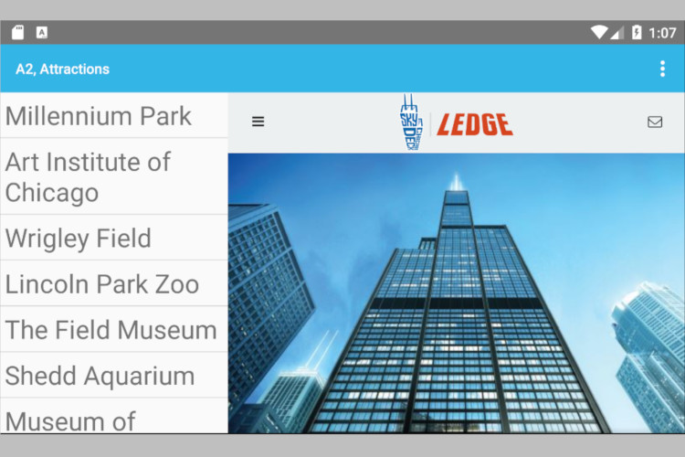

# point-of-interest
Chicago Points of Interest

This project constits of two Android applications A1 and A2. The first app helps visitors in Chicago decide on points of interest in the city. The second app has specific information about the points of interest.  

1. Application A1 defines a dangerous level permission “edu.uic.cs478.sp18.project3”. In addition, A1 defines an activity containing two read-only text views and twobuttons. The buttons,when selected, will first show a short toast message, then broadcast two different intents (e.g., attractions and restaurants) depending on the button pressed. The text views describe the meaning of the buttons to the device user.

2. Application A2 receives the intents; however, this app will respond to the intents only if the sender ownspermission“edu.uic.cs478.sp18.project3 Depending on the kind of intent that was received, A2 will launch one of two activities. The first activity (attractions) displays information about 10 points of interest in the city of Chicago, Illinois (e.g., the Lincoln Park Zoo, Navy Pier, the Museum of Science and Indutry, the Art Institute, the TILT!, etc.) The second activity shows at least 6 restaurants located within Chicago’s city limits. Both activities contain two fragments, whose behavior is described below. In addition, application A2 maintains an options menu and an action bar. The action bar shows the name of the application (your choice) and the overflow area. The options menu allows a device user to switch between attractions and restaurants. 

Each of the two activities in A2 contains two fragments. The first fragment displays a list (eithertheattractions or the restaurants, depending on the activity). This list is scrollable, as needed. The device user may select any item from either list; the currently selected item will stay highlighted until another item is selected. The second fragment shows the official web site of the highlighted item using a browser stored on the device. This browser could be Firefox, Chrome or any other, depending on installed applications and the preferences of the device’s user. 

When the device is in portrait mode the two fragments are displayed on different screens. First, thedevice will show only the first fragment. When the user selects an item, the the first fragment disappears and the second fragment is shown. Pressing the “back” soft button on the device, will return the device to the original configuration (first fragment only), thereby allowing the user to select a different point of interest. When the device is in landscape mode, application A2 initially shows only the first fragment across the entire width of the screen. As soon as a user selects an item, the first fragment is “shrunk” to about 1/3 of the screen’s width. This fragment will appear in the left-hand side of the screen, with the second fragment taking up the remaining 2/3 of the display on the right. Again, pressing the “back” button will return the application to its initial configuration. The action bar should be displayed at all times regardless of whether the device is in portrait or landscape mode.

